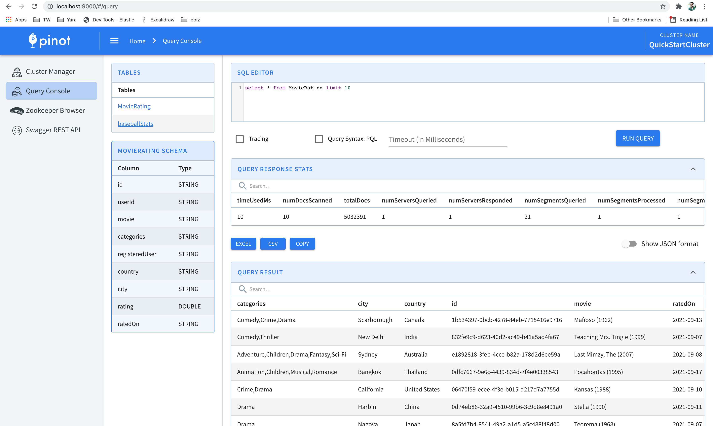
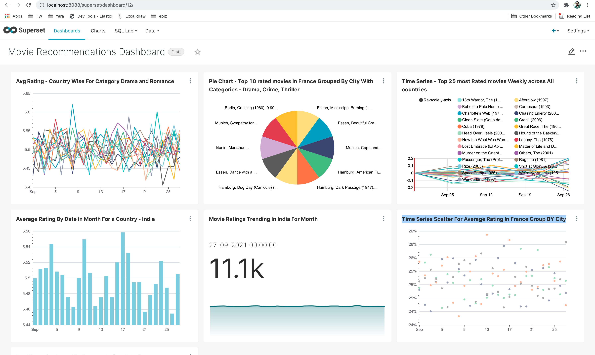

# Movie Rating Data Analytics Using Apache Pinot and Visualized using Apache Superset

### What is Apache Pinot?
Apache Pinot is a distributed OLAP data store, built to deliver real-time analytics with low latency. It can ingest from batch data sources (such as Hadoop HDFS, Amazon S3, Azure ADLS or Google Cloud Storage) as well as stream data sources (such as Apache Kafka).
In terms of scale, largest Pinot Production clusters are known to handle more than 1M+ events/sec. 170k+ queries/sec with latency in several milliseconds.

### What is Apache Superset?
Superset is fast, lightweight, intuitive, and loaded with options that make it easy for users of all skill sets to explore and visualize their data, from simple line charts to highly detailed geospatial charts.

## Use Case

Movie Rating generator will stream ingest events of movie ratings across different countries and their corresponding cities. The user base is more than 5 Lakhs and movies are more than 70k. _Approximately 5k events are pushed every second through Kafka onto Apache Pinot_.


#### Different Reports are
-   Avg Rating Country Wise For Category Drama and Romance.
-   Pie Chart Top 10 rated movies in France Grouped By City With Categories: Drama, Crime, Thriller.
-   Time Series — Top 25 most Rated movies Weekly across All countries.
-   Average Rating By Date in Month For a Country — India.
-   Movie Ratings Trending In India For Month.
-   Time Series Scatter For Average Rating In France Group BY City.

#### Environment
- Docker Compose.
- Spring Boot 2.
- Apache Superset (Installed in My mac) Please visit this [site](https://superset.apache.org/docs/installation/installing-superset-from-scratch) for steps.
- Java 11.
- Apache Kafka (through docker).

### Set the Infrastructure using docker
``` shell
$ docker-compose up -d
Wait After everything comes up
$ docker-compose ps
--------------------------------------------------------------------------------------------------------------------------------------------------------------------------------------------------
kafka                          /etc/confluent/docker/run        Up      0.0.0.0:29092->29092/tcp,:::29092->29092/tcp, 0.0.0.0:9092->9092/tcp,:::9092->9092/tcp                                    
movie-recommendation_pinot_1   ./bin/pinot-admin.sh Quick ...   Up      0.0.0.0:8000->8000/tcp,:::8000->8000/tcp, 8096/tcp, 8097/tcp, 8098/tcp, 8099/tcp, 0.0.0.0:9000->9000/tcp,:::9000->9000/tcp
zookeeper                      /docker-entrypoint.sh zkSe ...   Up      0.0.0.0:2181->2181/tcp,:::2181->2181/tcp, 2888/tcp, 3888/tcp, 8080/tcp                                                    
                                          
```
### Create Table and Segments in Pinot
In the application we have already had a folder `pinot` that had schema definition and index specification. The index type `star-tree` is created for pre-aggregation purposes.

- Copy the pinot related data in to docker machine so we can exeute them inside docker
``` shell
docker cp ./pinot movie-recommendation_pinot_1:.  
```
- Create table in Apache Pinot
``` shell
docker exec movie-recommendation_pinot_1 bin/pinot-admin.sh AddTable \                     
-tableConfigFile /pinot/movie-review-table-definition.json \
-schemaFile /pinot/movie-review-schema-definition.json \
-exec

Executing command: AddTable -tableConfigFile /pinot/movie-review-table-definition.json -schemaFile /pinot/movie-review-schema-definition.json -controllerProtocol http -controllerHost 172.18.0.4 -controllerPort 9000 -exec
Sending request: http://172.18.0.4:9000/schemas to controller: 1683475625b7, version: Unknown
{"status":"Table MovieRating_REALTIME succesfully added"}
```
### Access Apache Pinot
Apache pinot can be accessed from port 9000. http://localhost:9000/. And have a look at MovieReview table.


### Access Superset
Apache Superset can be accessed from default port 8088. I have created a dashboard. You can create on your own.


